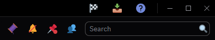
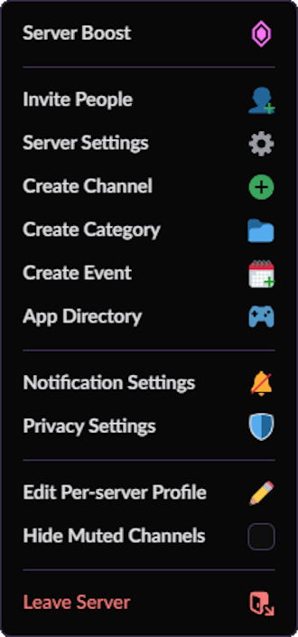
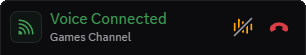
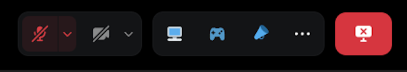

# DisColorFull SVG
Fills in Discords bland SVG's with Color/Colorized Versions. 
Inspired by [NYRI4](https://github.com/NYRI4)'s [Discolored](https://github.com/NYRI4/Discolored) Theme.

All linked replacement SVG's are natively available from within Discord.

Theme Author's are free to import for use within their own works, but please give Credit.

## To Do:
Maintain for Class Changes / Discord Updates

## Screenshots

General Chatting Toolbar: 

General Toolbar in DM's: 

Server Drop Down Menu: 

Avatar Wrapper - Connected: 

Server Channel Mute/Deafen: 

