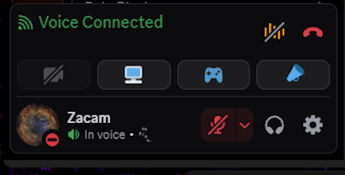

### DisColorFull SVG
Fills in Discords bland SVG's with Color/Colorized Versions.
Inspired by @NYRI4's <a href="https://github.com/NYRI4/Discolored/">`Discolored'</a> Theme.

All linked replacement SVG's are natively available from within Discord.

Theme Author's are free to import for use within their own works, but please give Credit.

### To Do:
Maintain for Class Changes / Discord Updates

### Screenshots

General Chatting Toolbar: 

General Toolbar in DM's: 

Server Drop Down Menu: 

Avatar Wrapper - Connected: 

Server Channel Mute/Deafen: 

