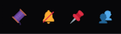

### DisColorFull
Fills in Discords bland SVG's with Color/Colorized Versions.
Inspired by @NYRI4's <a href="https://github.com/NYRI4/Discolored/">`Discolored'</a> Theme.

All linked replacement SVG's are natively available from within Discord.

Limited Compatiblity with CollapsibleUI Plugin SVG's.

Theme Author's are free to import for use within their own works.

### To Do:
Since this themelete currently uses a LOT of aria-labels, it will presently only work correctly on EN language users.
Discord needs to data-type some things before this can become and International Themelete, sadly.

### Screenshots

General Chatting Toolbar: 

General Toolbar in DM's: 

Server Drop Down Menu: 

User Panel on connected to VC: 

VC Action Bar: 

