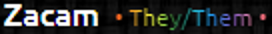

# PronounDB
Theme for the PronounDB Plugin by Strencher to stylize the Pronoun Text color

# Customization
For `v1.4.0` if you want the dot and spacing as shown in the screenshot:

Alter line `7363` to go from:
`pronoun.pronouns`

To look like:
`pronoun.pronouns, " ", "\u2022", "\u00A0"`

### Screenshot

