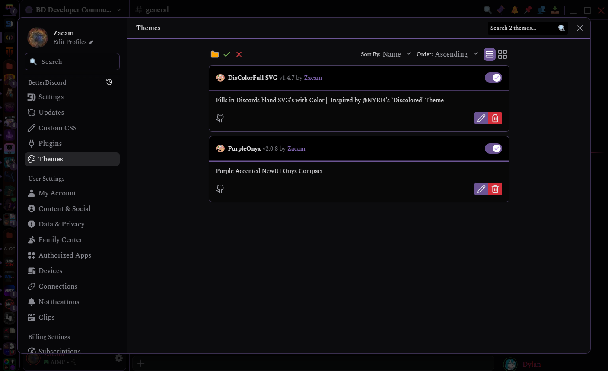
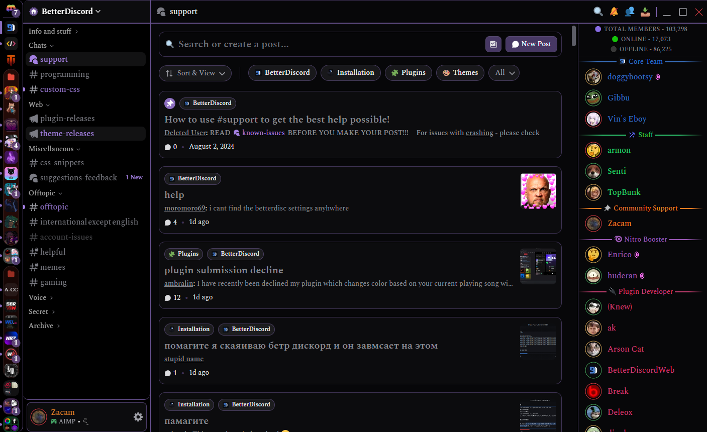
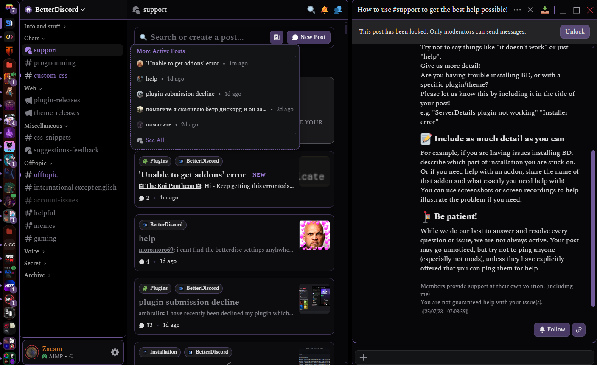
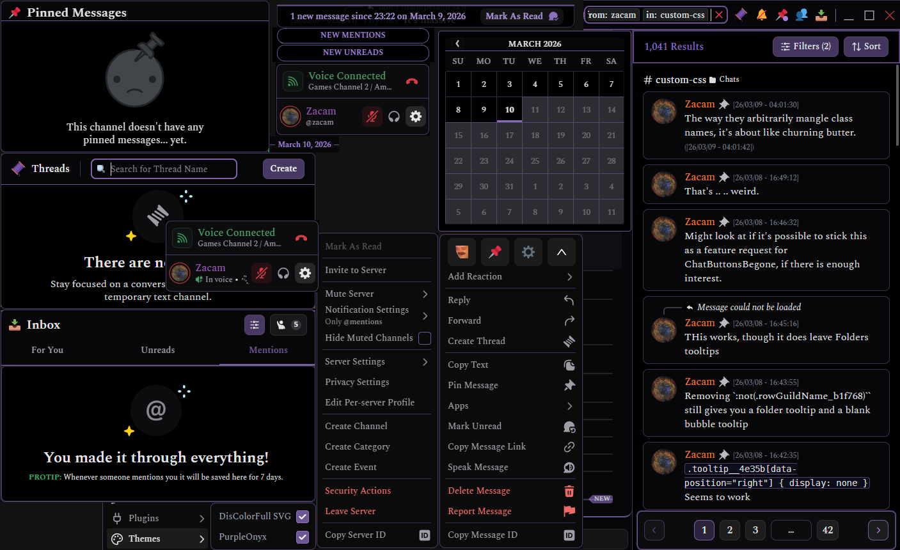

## PurpleOnyx Theme
With the advent of Onyx Theme to Desktop, Discord got close to satisfying what I wanted. 
 
This completes what I wanted that Discord still doesn't address. 
 
Features reduced padding/margins and more compact menu's; all with a light accent of various shades of Purple. 

Initial Settings: 
Onyx (midnight) should be enabled. Theme was built based on "UI Density" and "Message Spacing" set to "Compact" 
User Avatars are hidden, and "Space Between" is set to Zero. 

<ins>Featured/Configured Imports</ins>: 
<a href="https://github.com/DiscordStyles/RadialStatus">RadialStatus</a> by @Gibbu 
<a href="https://github.com/mwittrien/BetterDiscordAddons/tree/master/Themes/ServerColumns">ServerColumns</a> by @DevilBro 
<a href="https://github.com/davart154/Themes/tree/main/Snippets/Mana%20Page%20Switcher">Mana Page Switcher</a> by @davert154 

<ins>Featured Plugins</ins>: 
<a href="https://github.com/LancersBucket/ChatButtonsBegone">ChatButtonBegone</a> by @LancersBucket 
<a href="https://github.com/mwittrien/BetterDiscordAddons/tree/master/Plugins/OldTitleBar">OldTitlebar</a> by @DevilBro 

<ins>Compatible Plugins</ins>: 
<a href="https://github.com/mwittrien/BetterDiscordAddons/tree/master/Plugins/CompleteTimestamps">CompleteTimestamps</a> by @DevilBro 
<a href="https://github.com/DaddyBoard/BD-Plugins/tree/main/MoreRoleColors">MoreRoleColors</a> by @DaddyBoard 
<a href="https://github.com/KingGamingYT/SimpleUserMenu">SimpleUserMenu</a> by @KingGamingYT 

## PurpleOnyx Lite Theme 
Does not include the Imports or CSS for ServerColumns, RadialStatus, or ManaPageSwitcher 
Does not include any Plugin compatibilicy CSS changes. 

### To Do:
Maintain classes, any necessary bug-fixes.

### Screenshots

