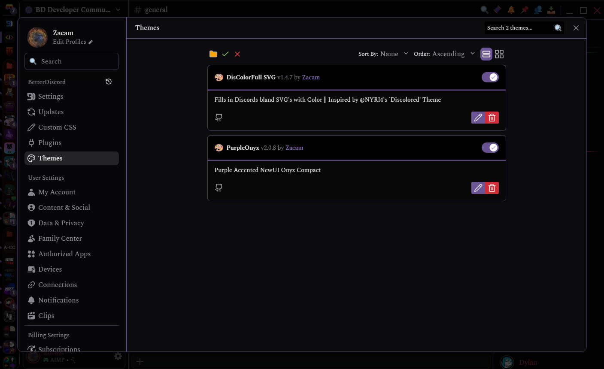
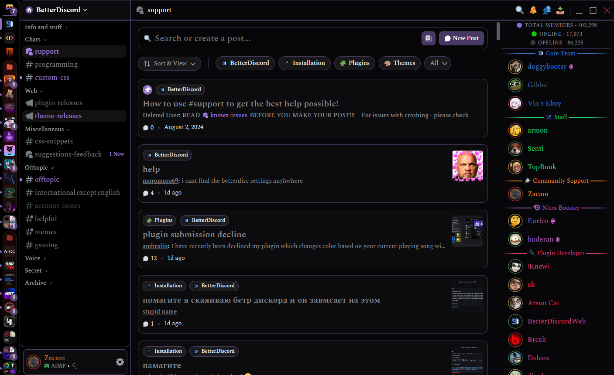
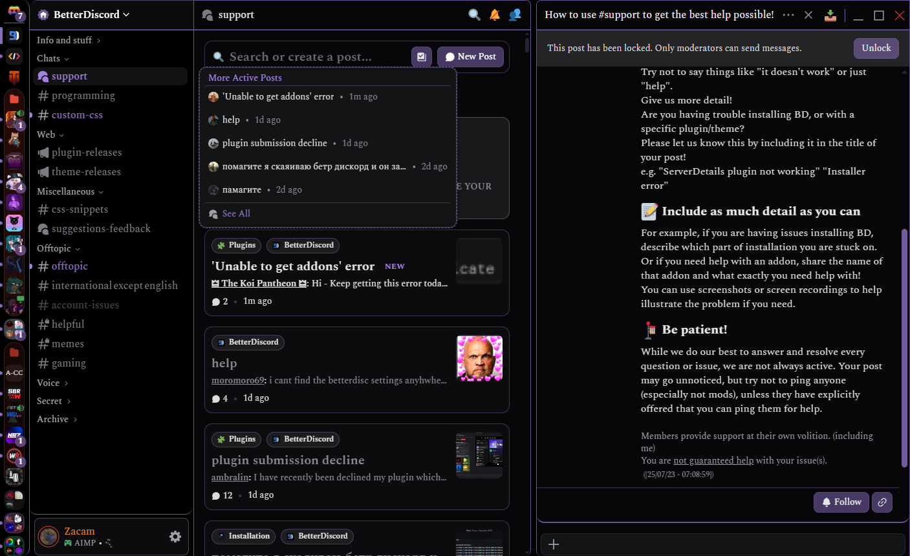
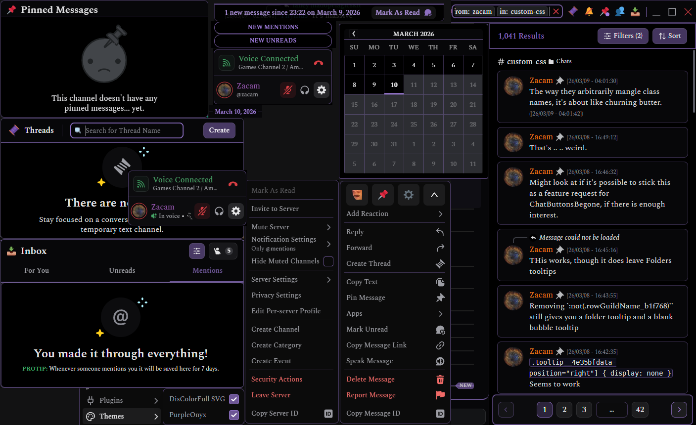

# PurpleOnyx Theme
With the advent of Onyx Theme to Desktop, Discord got close to satisfying what I wanted. 
 
This completes what I wanted that Discord still doesn't address. 
 
Features reduced padding/margins and more compact menu's; all with a light accent of various shades of Purple. 
Uses a CSS Removal of the Titlebar, which -may- cause conflicts with some Plugins. 

Initial Settings: 
Onyx (Midnight) should be enabled. Theme was built based on "UI Density" and "Message Spacing" set to "Compact" 
User Avatars are hidden, and "Space Between" is set to Zero. 

<ins>Featured/Configured Imports</ins>: 
[RadialStatus](https://github.com/DiscordStyles/RadialStatus) by [Gibbu](https://github.com/Gibbu) 
[ServerColumns](https://github.com/mwittrien/BetterDiscordAddons/tree/master/Themes/ServerColumns) by [DevilBro](https://github.com/mwittrien) 
[Mana Page Switcher](https://github.com/davart154/Themes/tree/main/Snippets/Mana%20Page%20Switcher) by [davert154](https://github.com/davart154) 

<ins>Featured Plugins</ins>: 
[ChatButtonBegone](https://github.com/LancersBucket/ChatButtonsBegone) by [LancersBucket](https://github.com/LancersBucket) 
[MoreRoleColors](https://github.com/DaddyBoard/BD-Plugins/tree/main/MoreRoleColors) by [DaddyBoard](https://github.com/DaddyBoard) 
[MemberCounter](https://github.com/SyndiShanX/Better-Discord-Plugins/tree/main/MemberCounter) by [SyndiShanX](https://github.com/SyndiShanX) 

<ins>Compatible/Recommended Plugins</ins>: 
[CompleteTimestamps](https://github.com/mwittrien/BetterDiscordAddons/tree/master/Plugins/CompleteTimestamps) by [DevilBro](https://github.com/mwittrien) 
[NewOldProfiles](https://github.com/KingGamingYT/NewOldProfiles) by [KingGamingYT](https://github.com/KingGamingYT) 
[SimpleUserMenu](https://github.com/KingGamingYT/SimpleUserMenu) by [KingGamingYT](https://github.com/KingGamingYT) 

## PurpleOnyx Lite Theme 
Does not include the Imports or CSS for ServerColumns, RadialStatus, or ManaPageSwitcher 
Does not include any Plugin compatibilicy CSS changes. 

## To Do:
Maintain classes, any necessary bug-fixes.

## Screenshots

